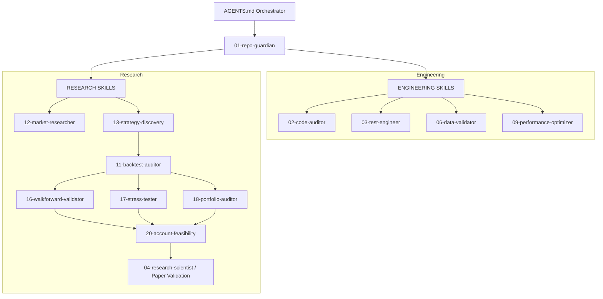

# Antigravity Agent Execution Hierarchy

This file orchestrates the workflow for the Antigravity agent when working in this repository. 
Do not blindly modify code or test strategies. Enforce the following hierarchy.

## Execution Hierarchy

## Protocol
1. **Research skill** discovers or tests a concept.
2. **Experiment skill** isolates and logs the test.
3. **Audit skill** rigorously verifies the test data.
4. **Validation skill** approves or rejects it.
5. **Only then** can production modifications be considered.
