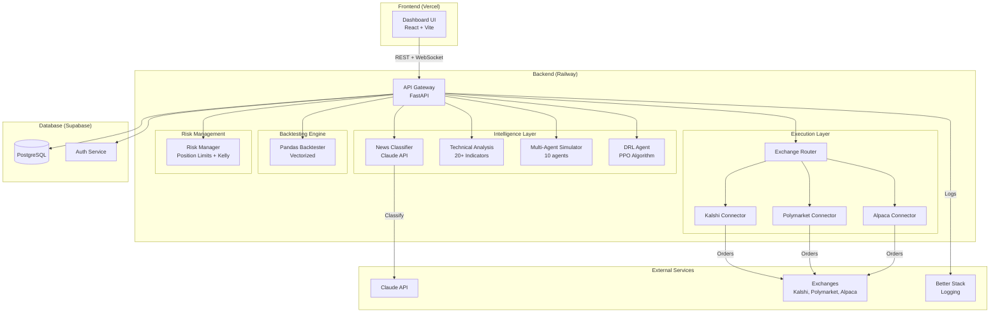
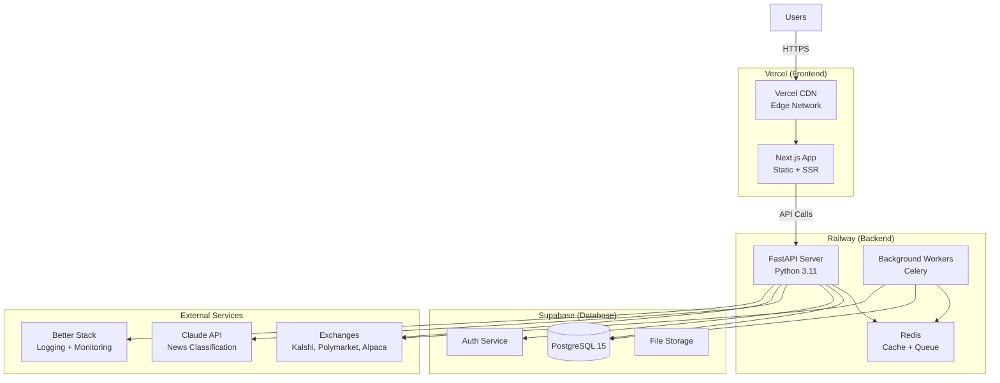

# Design Document: Unified Trading Intelligence Platform Phase 1

## Overview

The Unified Trading Intelligence Platform Phase 1 MVP is a comprehensive AI-powered trading system that integrates 6 battle-tested repositories into a cohesive platform. The system provides real-time news classification, technical analysis with 20+ indicators, multi-agent simulation for high-stakes trades, connectivity to 12+ exchanges, PPO reinforcement learning agents, and vectorized backtesting capabilities.

### Core Value Proposition

- **Intelligence Layer**: Real-time news classification (Claude API), 20+ technical indicators computed locally, multi-agent simulation for trade validation
- **Execution Layer**: 12+ exchange connectors (CEX, DEX, prediction markets, stocks), unified order routing, paper trading mode
- **Backtesting Engine**: Vectorized backtesting processing 1 year of data in 1-2 minutes
- **Risk Management**: Position limits, Kelly criterion sizing, drawdown protection, constitutional guardrails for DRL agents
- **User Experience**: Web dashboard for portfolio monitoring, signal feeds, trade history, and backtesting

### Design Principles

1. **Pluggable Architecture**: All major components (exchanges, strategies, backtesting engines, DRL agents) implement well-defined interfaces enabling zero-refactoring integration of future phases
2. **Separation of Concerns**: Intelligence Layer, Execution Layer, and Backtesting Engine are decoupled and communicate through clean APIs
3. **Safety First**: Paper trading only in Phase 1, constitutional guardrails for DRL agents, comprehensive risk management
4. **Performance**: Vectorized operations, caching, connection pooling, sub-second API responses
5. **Resilience**: Exponential backoff retries, circuit breakers, graceful degradation, comprehensive error handling

## Architecture

### High-Level System Architecture



### Component Interaction Flow

**News-Driven Trading Flow**:
1. News article arrives → News Classifier (Claude API)
2. Classification result → Market Matcher → Trading Signal
3. Signal → Technical Analysis (validate with indicators)
4. Signal → Risk Manager (check limits)
5. If high-stakes (>$1K) → Multi-Agent Simulator
6. Approved signal → Exchange Router → Order Execution
7. Trade result → Database → Dashboard update

**DRL-Driven Trading Flow**:
1. Market state → DRL Agent (PPO)
2. Predicted action → Constitutional Guardrails check
3. Action → Risk Manager (check limits)
4. Approved action → Exchange Router → Order Execution
5. Trade result → Database → Dashboard update

**Backtesting Flow**:
1. User selects strategy + date range + asset
2. Historical data fetched from database/exchange
3. Pandas Backtester runs vectorized simulation
4. Metrics computed (return, Sharpe, drawdown, win rate)
5. Results displayed in Dashboard with equity curve

## Components and Interfaces

### 1. Exchange Connector Interface

The `ExchangeConnector` interface provides a unified abstraction for all exchange integrations, enabling seamless addition of new exchanges without modifying existing code.

```typescript
// src/core/interfaces/ExchangeConnector.ts

export interface Market {
  symbol: string;
  baseAsset: string;
  quoteAsset: string;
  minOrderSize: number;
  maxOrderSize: number;
  pricePrecision: number;
  sizePrecision: number;
}

export interface OrderBook {
  symbol: string;
  bids: [price: number, size: number][];
  asks: [price: number, size: number][];
  timestamp: number;
}

export interface Ticker {
  symbol: string;
  lastPrice: number;
  bidPrice: number;
  askPrice: number;
  volume24h: number;
  timestamp: number;
}

export interface Order {
  symbol: string;
  side: 'buy' | 'sell';
  type: 'market' | 'limit';
  size: number;
  price?: number;
  timeInForce?: 'GTC' | 'IOC' | 'FOK';
}

export interface Trade {
  id: string;
  orderId: string;
  symbol: string;
  side: 'buy' | 'sell';
  price: number;
  size: number;
  fee: number;
  timestamp: number;
}

export interface Position {
  symbol: string;
  size: number;
  avgPrice: number;
  currentPrice: number;
  unrealizedPnl: number;
  realizedPnl: number;
}

export interface ExchangeConnector {
  name: string;
  type: 'cex' | 'dex' | 'prediction' | 'stocks';
  
  // Connection management
  connect(): Promise<void>;
  disconnect(): Promise<void>;
  isConnected(): boolean;
  
  // Market data
  getMarkets(): Promise<Market[]>;
  getOrderBook(symbol: string): Promise<OrderBook>;
  getTicker(symbol: string): Promise<Ticker>;
  
  // Trading
  placeOrder(order: Order): Promise<Trade>;
  cancelOrder(orderId: string): Promise<void>;
  getPosition(symbol: string): Promise<Position>;
  getPositions(): Promise<Position[]>;
  
  // Account
  getBalance(): Promise<{ [asset: string]: number }>;
}
```

**Phase 1 Implementations**:
- `KalshiConnector`: Prediction market connector for Kalshi
- `PolymarketConnector`: Prediction market connector for Polymarket  
- `AlpacaConnector`: Stock broker connector for Alpaca (paper trading only)

**Future Phases** (drop-in replacements):
- Phase 1.5: `BinanceConnector`, `CoinbaseConnector` (from Freqtrade)
- Phase 2: `HyperliquidConnector`, `dYdXConnector` (from existing repos)

### 2. Strategy Executor Interface

The `StrategyExecutor` interface enables pluggable trading strategies with consistent execution and backtesting APIs.

```typescript
// src/core/interfaces/StrategyExecutor.ts

export interface Signal {
  asset: string;
  direction: 'long' | 'short' | 'neutral';
  confidence: number; // 0-1
  rationale: string;
  indicators?: { [key: string]: number };
  timestamp: number;
}

export interface BacktestResult {
  totalReturn: number;
  sharpeRatio: number;
  maxDrawdown: number;
  winRate: number;
  trades: Trade[];
  equityCurve: { timestamp: number; equity: number }[];
}

export interface RiskCheck {
  approved: boolean;
  reason?: string;
  adjustedSize?: number;
}

export interface StrategyExecutor {
  name: string;
  type: 'directional' | 'market-making' | 'grid' | 'arbitrage';
  
  // Execution
  execute(signal: Signal): Promise<Trade>;
  
  // Backtesting
  backtest(data: HistoricalData, params: StrategyParams): Promise<BacktestResult>;
  
  // Risk management
  checkRisk(order: Order, portfolio: Portfolio): Promise<RiskCheck>;
}
```

**Phase 1 Implementations**:
- `DirectionalStrategy`: Basic long/short strategy based on signals

**Future Phases**:
- Phase 1.5: `GridTradingStrategy` (from Passivbot)
- Phase 2: `MarketMakingStrategy`, `ArbitrageStrategy`

### 3. Backtester Interface

The `Backtester` interface enables pluggable backtesting engines with consistent APIs for strategy validation.

```python
# src/core/interfaces/backtester.py

from abc import ABC, abstractmethod
from typing import Dict, List, Any
from dataclasses import dataclass

@dataclass
class BacktestMetrics:
    total_return: float
    sharpe_ratio: float
    max_drawdown: float
    win_rate: float
    total_trades: int
    avg_trade_duration: float
    profit_factor: float

class Backtester(ABC):
    def __init__(self, backtester_type: str):
        self.type = backtester_type  # 'event-driven' or 'vectorized'
    
    @abstractmethod
    def run(self, strategy: Any, data: Any, params: Dict) -> Dict:
        """Run backtest and return results"""
        pass
    
    @abstractmethod
    def optimize(self, strategy: Any, data: Any, param_grid: Dict) -> Dict:
        """Optimize strategy parameters"""
        pass
    
    @abstractmethod
    def get_metrics(self, result: Dict) -> BacktestMetrics:
        """Compute performance metrics"""
        pass
```

**Phase 1 Implementation**:
- `PandasBacktester`: Vectorized backtester using pandas (1-2 min for 1 year)

**Phase 1.5 Upgrade** (drop-in replacement):
- `VectorBTBacktester`: 10-100x faster, same interface

### 4. DRL Agent Interface

The `DRLAgent` interface enables pluggable reinforcement learning agents with consistent prediction and training APIs.

```python
# src/core/interfaces/drl_agent.py

from abc import ABC, abstractmethod
import numpy as np
from typing import Dict, Any

class DRLAgent(ABC):
    def __init__(self, name: str, algorithm: str):
        self.name = name
        self.algorithm = algorithm  # 'PPO', 'A2C', 'SAC', etc.
    
    @abstractmethod
    def predict(self, state: np.ndarray) -> int:
        """Predict action from state
        
        Returns:
            action: 0 (hold), 1 (buy), 2 (sell)
        """
        pass
    
    @abstractmethod
    def train(self, env: Any, total_timesteps: int) -> None:
        """Train agent on environment"""
        pass
    
    @abstractmethod
    def save(self, path: str) -> None:
        """Save model weights"""
        pass
    
    @abstractmethod
    def load(self, path: str) -> None:
        """Load model weights"""
        pass
```

**Phase 1 Implementation**:
- `PPOAgent`: Proximal Policy Optimization agent from Fiduciary Sentinel

**Phase 2 Enhancements**:
- `EnsembleDRLAgent`: Weighted voting across multiple agents (PPO, A2C, SAC)

## Data Models

### Database Schema

```sql
-- Users table
CREATE TABLE users (
  id UUID PRIMARY KEY DEFAULT gen_random_uuid(),
  email TEXT UNIQUE NOT NULL,
  password_hash TEXT NOT NULL,
  created_at TIMESTAMP DEFAULT NOW(),
  updated_at TIMESTAMP DEFAULT NOW(),
  
  -- Quota limits
  max_strategies INT DEFAULT 10,
  max_trades_per_day INT DEFAULT 100,
  max_api_calls_per_hour INT DEFAULT 1000
);

-- API keys table (encrypted)
CREATE TABLE api_keys (
  id UUID PRIMARY KEY DEFAULT gen_random_uuid(),
  user_id UUID REFERENCES users(id) ON DELETE CASCADE,
  exchange TEXT NOT NULL,
  key_encrypted TEXT NOT NULL,
  secret_encrypted TEXT NOT NULL,
  is_valid BOOLEAN DEFAULT true,
  last_validated_at TIMESTAMP,
  created_at TIMESTAMP DEFAULT NOW()
);

-- Strategies table
CREATE TABLE strategies (
  id UUID PRIMARY KEY DEFAULT gen_random_uuid(),
  user_id UUID REFERENCES users(id) ON DELETE CASCADE,
  name TEXT NOT NULL,
  type TEXT NOT NULL,  -- 'directional', 'grid', 'market-making', 'arbitrage'
  config JSONB NOT NULL,
  is_active BOOLEAN DEFAULT false,
  created_at TIMESTAMP DEFAULT NOW(),
  updated_at TIMESTAMP DEFAULT NOW()
);

-- Trades table
CREATE TABLE trades (
  id UUID PRIMARY KEY DEFAULT gen_random_uuid(),
  user_id UUID REFERENCES users(id) ON DELETE CASCADE,
  strategy_id UUID REFERENCES strategies(id) ON DELETE SET NULL,
  exchange TEXT NOT NULL,
  symbol TEXT NOT NULL,
  side TEXT NOT NULL,  -- 'buy', 'sell'
  type TEXT NOT NULL,  -- 'market', 'limit'
  price DECIMAL(20, 8) NOT NULL,
  size DECIMAL(20, 8) NOT NULL,
  fee DECIMAL(20, 8) DEFAULT 0,
  pnl DECIMAL(20, 8),
  timestamp TIMESTAMP DEFAULT NOW(),
  
  -- Indexes for fast queries
  INDEX idx_trades_user_id (user_id),
  INDEX idx_trades_strategy_id (strategy_id),
  INDEX idx_trades_symbol (symbol),
  INDEX idx_trades_timestamp (timestamp)
);

-- Positions table
CREATE TABLE positions (
  id UUID PRIMARY KEY DEFAULT gen_random_uuid(),
  user_id UUID REFERENCES users(id) ON DELETE CASCADE,
  exchange TEXT NOT NULL,
  symbol TEXT NOT NULL,
  size DECIMAL(20, 8) NOT NULL,
  avg_price DECIMAL(20, 8) NOT NULL,
  current_price DECIMAL(20, 8),
  unrealized_pnl DECIMAL(20, 8),
  realized_pnl DECIMAL(20, 8) DEFAULT 0,
  updated_at TIMESTAMP DEFAULT NOW(),
  
  -- Unique constraint: one position per user/exchange/symbol
  UNIQUE(user_id, exchange, symbol)
);

-- Signals table (from Intelligence Layer)
CREATE TABLE signals (
  id UUID PRIMARY KEY DEFAULT gen_random_uuid(),
  user_id UUID REFERENCES users(id) ON DELETE CASCADE,
  source TEXT NOT NULL,  -- 'news', 'technical', 'drl', 'simulation'
  asset TEXT NOT NULL,
  direction TEXT NOT NULL,  -- 'long', 'short', 'neutral'
  confidence DECIMAL(3, 2) NOT NULL,  -- 0.00 to 1.00
  rationale TEXT,
  indicators JSONB,
  timestamp TIMESTAMP DEFAULT NOW(),
  
  INDEX idx_signals_user_id (user_id),
  INDEX idx_signals_timestamp (timestamp)
);

-- Audit log table
CREATE TABLE audit_log (
  id UUID PRIMARY KEY DEFAULT gen_random_uuid(),
  user_id UUID REFERENCES users(id) ON DELETE SET NULL,
  action TEXT NOT NULL,
  details JSONB,
  ip_address INET,
  timestamp TIMESTAMP DEFAULT NOW(),
  
  INDEX idx_audit_user_id (user_id),
  INDEX idx_audit_timestamp (timestamp)
);
```

### API Request/Response Models

```typescript
// Authentication
interface RegisterRequest {
  email: string;
  password: string;
}

interface LoginRequest {
  email: string;
  password: string;
}

interface AuthResponse {
  token: string;
  user: {
    id: string;
    email: string;
  };
}

// Trading
interface PlaceOrderRequest {
  exchange: string;
  symbol: string;
  side: 'buy' | 'sell';
  type: 'market' | 'limit';
  size: number;
  price?: number;
}

interface PlaceOrderResponse {
  trade: Trade;
  position: Position;
}

// Intelligence
interface ClassifyNewsRequest {
  article: {
    title: string;
    content: string;
    source: string;
    url: string;
  };
}

interface ClassifyNewsResponse {
  classification: {
    sentiment: 'bullish' | 'bearish' | 'neutral';
    confidence: number;
    asset?: string;
    rationale: string;
  };
  signal?: Signal;
}

interface ComputeIndicatorsRequest {
  symbol: string;
  timeframe: '1m' | '5m' | '15m' | '1h' | '4h' | '1d';
  indicators: string[];  // ['EMA_20', 'RSI_14', 'MACD', ...]
}

interface ComputeIndicatorsResponse {
  symbol: string;
  timestamp: number;
  indicators: {
    [key: string]: number;
  };
}

// Backtesting
interface BacktestRequest {
  strategy_id: string;
  symbol: string;
  start_date: string;
  end_date: string;
  initial_capital: number;
}

interface BacktestResponse {
  metrics: BacktestMetrics;
  equity_curve: { timestamp: number; equity: number }[];
  trades: Trade[];
}
```


## REST API Design

### Base URL
- Development: `http://localhost:8000/api/v1`
- Production: `https://api.trading-platform.railway.app/api/v1`

### Authentication
All endpoints except `/auth/register` and `/auth/login` require JWT token in header:
```
Authorization: Bearer <token>
```

### Endpoints

#### Authentication
```
POST   /auth/register          Register new user
POST   /auth/login             Login user
POST   /auth/logout            Logout user
POST   /auth/refresh           Refresh JWT token
POST   /auth/reset-password    Request password reset
```

#### User Management
```
GET    /users/me               Get current user profile
PUT    /users/me               Update user profile
DELETE /users/me               Delete user account
```

#### API Keys
```
GET    /api-keys               List user's API keys (masked)
POST   /api-keys               Add new API key
DELETE /api-keys/:id           Delete API key
POST   /api-keys/:id/validate  Validate API key
```

#### Strategies
```
GET    /strategies             List user's strategies
POST   /strategies             Create new strategy
GET    /strategies/:id         Get strategy details
PUT    /strategies/:id         Update strategy
DELETE /strategies/:id         Delete strategy
POST   /strategies/:id/start   Start strategy execution
POST   /strategies/:id/stop    Stop strategy execution
```

#### Trading
```
GET    /exchanges              List available exchanges
GET    /exchanges/:name/markets Get markets for exchange
POST   /orders                 Place order
DELETE /orders/:id             Cancel order
GET    /positions              Get all positions
GET    /positions/:symbol      Get position for symbol
GET    /trades                 Get trade history
```

#### Intelligence Layer
```
POST   /intelligence/classify-news      Classify news article
POST   /intelligence/indicators         Compute technical indicators
POST   /intelligence/simulate           Run multi-agent simulation
POST   /intelligence/drl/predict        Get DRL agent prediction
```

#### Backtesting
```
POST   /backtest               Run backtest
GET    /backtest/:id           Get backtest results
GET    /backtest/:id/trades    Get backtest trade log
```

#### Portfolio
```
GET    /portfolio              Get portfolio summary
GET    /portfolio/performance  Get performance metrics
GET    /portfolio/history      Get historical portfolio values
```

### WebSocket API

#### Connection
```
wss://api.trading-platform.railway.app/ws?token=<jwt_token>
```

#### Subscriptions

**News Feed**:
```json
{
  "action": "subscribe",
  "channel": "news",
  "filters": {
    "assets": ["BTC", "ETH"],
    "sentiment": ["bullish", "bearish"]
  }
}
```

**Signal Feed**:
```json
{
  "action": "subscribe",
  "channel": "signals",
  "filters": {
    "sources": ["news", "technical", "drl"],
    "min_confidence": 0.7
  }
}
```

**Portfolio Updates**:
```json
{
  "action": "subscribe",
  "channel": "portfolio"
}
```

**Trade Executions**:
```json
{
  "action": "subscribe",
  "channel": "trades"
}
```

## Infrastructure Design

### Deployment Architecture



### Railway Configuration

**Service**: `trading-platform-api`
- **Runtime**: Python 3.11
- **Start Command**: `uvicorn src.main:app --host 0.0.0.0 --port $PORT`
- **Health Check**: `GET /health`
- **Auto-scaling**: Disabled (free tier)
- **Memory**: 512MB (free tier limit)

**Environment Variables**:
```bash
# Database
DATABASE_URL=postgresql://...
REDIS_URL=redis://...

# Authentication
JWT_SECRET=<random-secret>
JWT_ALGORITHM=HS256
JWT_EXPIRATION_HOURS=24

# External APIs
ANTHROPIC_API_KEY=<claude-key>
KALSHI_API_KEY=<kalshi-key>
POLYMARKET_API_KEY=<polymarket-key>
ALPACA_API_KEY=<alpaca-key>
ALPACA_SECRET_KEY=<alpaca-secret>

# Encryption
ENCRYPTION_KEY=<aes-256-key>

# Logging
BETTERSTACK_SOURCE_TOKEN=<token>

# Feature Flags
ENABLE_PAPER_TRADING=true
ENABLE_REAL_TRADING=false
ENABLE_DRL_AGENT=true
ENABLE_SIMULATION=true
```

### Supabase Configuration

**Database**: PostgreSQL 15
- **Storage**: 500MB (free tier)
- **Connection Pooling**: Enabled (max 10 connections)
- **Backups**: Daily automatic backups

**Authentication**:
- Email/Password authentication
- OAuth providers: Google, GitHub
- JWT token expiration: 24 hours
- Password requirements: min 8 chars, 1 uppercase, 1 lowercase, 1 number

**Row Level Security (RLS)**:
```sql
-- Users can only access their own data
ALTER TABLE strategies ENABLE ROW LEVEL SECURITY;
CREATE POLICY "Users can view own strategies" ON strategies
  FOR SELECT USING (auth.uid() = user_id);

ALTER TABLE trades ENABLE ROW LEVEL SECURITY;
CREATE POLICY "Users can view own trades" ON trades
  FOR SELECT USING (auth.uid() = user_id);

ALTER TABLE positions ENABLE ROW LEVEL SECURITY;
CREATE POLICY "Users can view own positions" ON positions
  FOR SELECT USING (auth.uid() = user_id);
```

### Vercel Configuration

**Framework**: Next.js 14
- **Build Command**: `npm run build`
- **Output Directory**: `.next`
- **Node Version**: 18.x

**Environment Variables**:
```bash
NEXT_PUBLIC_API_URL=https://api.trading-platform.railway.app
NEXT_PUBLIC_WS_URL=wss://api.trading-platform.railway.app/ws
NEXT_PUBLIC_SUPABASE_URL=<supabase-url>
NEXT_PUBLIC_SUPABASE_ANON_KEY=<supabase-anon-key>
```

### Caching Strategy

**Redis Cache Layers**:

1. **Market Data Cache** (TTL: 10 seconds)
   - Ticker prices
   - Order books
   - Market lists

2. **Indicator Cache** (TTL: 60 seconds)
   - Technical indicator calculations
   - Keyed by: `indicators:{symbol}:{timeframe}:{indicators_hash}`

3. **User Session Cache** (TTL: 24 hours)
   - JWT token validation
   - User permissions

4. **Rate Limit Cache** (TTL: 1 hour)
   - API call counts per user
   - Exchange API call counts

**Cache Invalidation**:
- Market data: Time-based (TTL)
- Indicators: Time-based (TTL) + manual invalidation on new data
- User sessions: Manual invalidation on logout
- Rate limits: Time-based (TTL)

### Rate Limiting

**Free Tier Limits**:
- Railway: 500 hours/month, 512MB RAM, 1GB disk
- Supabase: 500MB database, 1GB bandwidth, 50K auth users
- Vercel: 100GB bandwidth, 100 builds/day

**Application Rate Limits**:
```python
# Per user limits
API_CALLS_PER_HOUR = 1000
TRADES_PER_DAY = 100
STRATEGIES_MAX = 10

# Per endpoint limits
NEWS_CLASSIFICATION_PER_HOUR = 100
SIMULATION_PER_HOUR = 20
BACKTEST_PER_HOUR = 10
```

**Implementation**:
```python
from fastapi import HTTPException
from redis import Redis
import time

class RateLimiter:
    def __init__(self, redis: Redis):
        self.redis = redis
    
    def check_limit(self, user_id: str, limit_type: str, max_calls: int, window_seconds: int):
        key = f"rate_limit:{user_id}:{limit_type}"
        current = self.redis.get(key)
        
        if current is None:
            self.redis.setex(key, window_seconds, 1)
            return True
        
        if int(current) >= max_calls:
            raise HTTPException(status_code=429, detail="Rate limit exceeded")
        
        self.redis.incr(key)
        return True
```

## Integration Strategy

### Repository Integration Plan

The platform integrates 6 existing repositories with minimal modifications:

#### 1. Daytona (Infrastructure)
**Status**: Deferred to Phase 2
**Reason**: Too complex for MVP, using Railway + Supabase instead
**Future Integration**: Phase 2 for multi-user sandboxes

#### 2. Polymarket Pipeline (News Classification)
**Files to Extract**:
```
polymarket-pipeline-main/
├── news_stream.py       → src/intelligence/news_stream.py
├── classifier.py        → src/intelligence/classifier.py
├── matcher.py           → src/intelligence/matcher.py
└── edge.py              → src/intelligence/edge.py
```

**Integration Points**:
- REST API: `POST /intelligence/classify-news`
- WebSocket: `/ws` channel `news`
- Database: Store signals in `signals` table

**Modifications**:
- Replace hardcoded API keys with environment variables
- Add error handling and retries
- Add caching for repeated articles

#### 3. Hyperliquid Agent (Technical Indicators)
**Files to Extract**:
```
hyperliquid-trading-agent-master/
├── indicators/local_indicators.py → src/intelligence/indicators.py
└── agent/decision_maker.py        → src/intelligence/llm_integration.py
```

**Integration Points**:
- REST API: `POST /intelligence/indicators`
- Used by: Strategy executors, DRL agent, backtesting engine

**Modifications**:
- Vectorize calculations using NumPy
- Add caching with Redis
- Support multiple timeframes

#### 4. MiroFish (Multi-Agent Simulation)
**Files to Extract**:
```
MiroFish-main/backend/
├── app/services/simulation_runner.py → src/intelligence/simulation.py
└── app/api/simulation_bp.py          → (integrated into main API)
```

**Integration Points**:
- REST API: `POST /intelligence/simulate`
- Triggered: Automatically for trades >$1K

**Modifications**:
- Reduce agent count (10 vs 1000) for speed
- Reduce rounds (5 vs 100) for speed
- Target: <30 seconds execution time
- Use OpenAI API or local Ollama

#### 5. OpenTradex (Exchange Connectors)
**Files to Extract**:
```
opentradex-main/src/
├── markets/kalshi.ts      → src/exchanges/kalshi.ts
├── markets/polymarket.ts  → src/exchanges/polymarket.ts
├── markets/alpaca.ts      → src/exchanges/alpaca.ts
├── risk.ts                → src/risk/risk_manager.ts
└── types.ts               → src/core/types.ts
```

**Integration Points**:
- Implement `ExchangeConnector` interface
- Used by: Exchange router, strategy executors

**Modifications**:
- Convert TypeScript to Python (or keep as microservice)
- Add paper trading mode enforcement
- Add comprehensive error handling

#### 6. Fiduciary Sentinel (RL Agent)
**Files to Extract**:
```
Fiduciary-Sentinel-Core/
├── rl_brain/agent.py      → src/drl/ppo_agent.py
├── rl_brain/trading_env.py → src/drl/trading_env.py
├── sentinel/core.py       → src/risk/sentinel.py
└── mcp/market_data.py     → src/data/market_data.py
```

**Integration Points**:
- REST API: `POST /intelligence/drl/predict`
- Implement `DRLAgent` interface

**Modifications**:
- Add constitutional guardrails
- Integrate with risk manager
- Support model save/load

### Integration Testing Strategy

**Phase 1: Unit Tests**
- Test each extracted component in isolation
- Mock external dependencies (APIs, databases)
- Target: 80% code coverage

**Phase 2: Integration Tests**
- Test component interactions
- Use testnet APIs where available
- Test database operations with test database

**Phase 3: End-to-End Tests**
- Test complete user flows
- Use paper trading mode
- Validate against requirements

**Test Pyramid**:
```
        /\
       /E2E\      10% - End-to-end tests
      /------\
     /  Integ \   30% - Integration tests
    /----------\
   /    Unit    \ 60% - Unit tests
  /--------------\
```

## Security Design

### Authentication & Authorization

**JWT Token Structure**:
```json
{
  "sub": "user_id",
  "email": "user@example.com",
  "exp": 1234567890,
  "iat": 1234567890,
  "permissions": ["trade", "backtest", "admin"]
}
```

**Password Security**:
- Hashing: bcrypt with 12 salt rounds
- Requirements: min 8 chars, 1 uppercase, 1 lowercase, 1 number, 1 special char
- Password reset: Time-limited tokens (1 hour expiration)

**OAuth Integration**:
- Providers: Google, GitHub
- Flow: Authorization Code with PKCE
- Scopes: email, profile

### API Key Encryption

**Encryption Method**: AES-256-GCM
```python
from cryptography.hazmat.primitives.ciphers.aead import AESGCM
import os

class APIKeyEncryption:
    def __init__(self, master_key: bytes):
        self.cipher = AESGCM(master_key)
    
    def encrypt(self, plaintext: str) -> tuple[bytes, bytes]:
        nonce = os.urandom(12)
        ciphertext = self.cipher.encrypt(nonce, plaintext.encode(), None)
        return nonce, ciphertext
    
    def decrypt(self, nonce: bytes, ciphertext: bytes) -> str:
        plaintext = self.cipher.decrypt(nonce, ciphertext, None)
        return plaintext.decode()
```

**Storage**:
```sql
CREATE TABLE api_keys (
  id UUID PRIMARY KEY,
  user_id UUID REFERENCES users(id),
  exchange TEXT NOT NULL,
  key_nonce BYTEA NOT NULL,
  key_encrypted BYTEA NOT NULL,
  secret_nonce BYTEA NOT NULL,
  secret_encrypted BYTEA NOT NULL,
  created_at TIMESTAMP DEFAULT NOW()
);
```

### Input Validation

**Request Validation** (using Pydantic):
```python
from pydantic import BaseModel, Field, validator

class PlaceOrderRequest(BaseModel):
    exchange: str = Field(..., regex="^(kalshi|polymarket|alpaca)$")
    symbol: str = Field(..., min_length=1, max_length=20)
    side: str = Field(..., regex="^(buy|sell)$")
    size: float = Field(..., gt=0, le=1000000)
    price: Optional[float] = Field(None, gt=0)
    
    @validator('size')
    def validate_size(cls, v, values):
        if 'exchange' in values and values['exchange'] == 'alpaca':
            if v > 10000:  # Max position size for paper trading
                raise ValueError('Size exceeds maximum for paper trading')
        return v
```

### SQL Injection Prevention

**Parameterized Queries** (using SQLAlchemy):
```python
from sqlalchemy import text

# BAD: String concatenation
query = f"SELECT * FROM trades WHERE user_id = '{user_id}'"

# GOOD: Parameterized query
query = text("SELECT * FROM trades WHERE user_id = :user_id")
result = db.execute(query, {"user_id": user_id})
```

### XSS Prevention

**Content Security Policy**:
```
Content-Security-Policy: default-src 'self'; 
  script-src 'self' 'unsafe-inline' 'unsafe-eval'; 
  style-src 'self' 'unsafe-inline'; 
  img-src 'self' data: https:; 
  font-src 'self' data:; 
  connect-src 'self' wss://api.trading-platform.railway.app;
```

**Output Encoding** (React automatically escapes):
```tsx
// React automatically escapes
<div>{userInput}</div>

// For raw HTML (avoid if possible)
<div dangerouslySetInnerHTML={{ __html: DOMPurify.sanitize(html) }} />
```

### CORS Configuration

```python
from fastapi.middleware.cors import CORSMiddleware

app.add_middleware(
    CORSMiddleware,
    allow_origins=[
        "http://localhost:3000",  # Development
        "https://trading-platform.vercel.app"  # Production
    ],
    allow_credentials=True,
    allow_methods=["GET", "POST", "PUT", "DELETE"],
    allow_headers=["*"],
)
```

### Rate Limiting & DDoS Protection

**Application-Level Rate Limiting**:
```python
from slowapi import Limiter, _rate_limit_exceeded_handler
from slowapi.util import get_remote_address

limiter = Limiter(key_func=get_remote_address)

@app.post("/api/orders")
@limiter.limit("10/minute")
async def place_order(request: Request):
    # Order placement logic
    pass
```

**Cloudflare Protection** (optional):
- DDoS protection
- Bot mitigation
- Rate limiting at edge

### Secrets Management

**Environment Variables** (never commit to Git):
```bash
# .env (gitignored)
DATABASE_URL=postgresql://...
JWT_SECRET=<random-secret>
ANTHROPIC_API_KEY=<key>
ENCRYPTION_KEY=<key>
```

**Secret Rotation**:
- JWT secrets: Rotate every 90 days
- API keys: Rotate on compromise
- Encryption keys: Rotate annually with re-encryption


## Correctness Properties

*A property is a characteristic or behavior that should hold true across all valid executions of a system—essentially, a formal statement about what the system should do. Properties serve as the bridge between human-readable specifications and machine-verifiable correctness guarantees.*

### Property Reflection

After analyzing all acceptance criteria, the following properties were identified as suitable for property-based testing. Several redundancies were eliminated:

- **Technical Indicators**: Properties 3.1-3.8 can be consolidated into fewer properties that test mathematical invariants rather than individual indicator formulas
- **Risk Management**: Properties 6.1-6.3 test similar limit enforcement patterns and can share test infrastructure
- **Backtesting Metrics**: Property 8.3 covers multiple metrics that can be tested together

The properties below represent the minimal set that provides comprehensive validation coverage without redundancy.

### Property 1: News Classification Output Structure

*For any* news classification result, the result SHALL contain a sentiment field with value in {bullish, bearish, neutral} and a confidence score in the range [0, 1].

**Validates: Requirements 2.3**

### Property 2: Trading Signal Structure

*For any* news article that matches a tradeable market, the generated trading signal SHALL contain non-empty asset, direction, and rationale fields.

**Validates: Requirements 2.4**

### Property 3: Technical Indicator Range Constraints

*For any* price series with sufficient data points:
- RSI SHALL be in the range [0, 100]
- ADX SHALL be in the range [0, 100]
- ATR SHALL be non-negative
- Bollinger Bands SHALL satisfy: lower_band ≤ middle_band ≤ upper_band

**Validates: Requirements 3.2, 3.4, 3.5, 3.6**

### Property 4: Technical Indicator Mathematical Properties

*For any* price series:
- EMA SHALL be a weighted average where recent prices have higher weight
- MACD SHALL equal the difference between fast EMA and slow EMA
- OBV SHALL be a cumulative sum that increases on up days and decreases on down days
- VWAP SHALL be the volume-weighted average price

**Validates: Requirements 3.1, 3.3, 3.7, 3.8**

### Property 5: Simulation Confidence Score Range

*For any* multi-agent simulation result, the confidence score SHALL be in the range [0, 1].

**Validates: Requirements 4.4**

### Property 6: Simulation Result Structure

*For any* multi-agent simulation result, the reasoning SHALL contain both agent consensus information and dissenting opinions.

**Validates: Requirements 4.6**

### Property 7: Position Size Risk Limit

*For any* portfolio with value V and proposed position with size S in asset A, if S > 0.10 * V, then the Risk_Manager SHALL reject the position.

**Validates: Requirements 6.1**

### Property 8: Total Exposure Risk Limit

*For any* portfolio with value V and set of positions P, if the sum of all position values exceeds 0.50 * V, then the Risk_Manager SHALL reject new positions until exposure is reduced.

**Validates: Requirements 6.2**

### Property 9: Leverage Risk Limit

*For any* position with notional value N and collateral C, if N / C > 10, then the Risk_Manager SHALL reject the position.

**Validates: Requirements 6.3**

### Property 10: Kelly Criterion Calculation

*For any* trading strategy with win probability p, average win W, and average loss L, the Kelly criterion position size SHALL equal f = (p * W - (1 - p) * L) / W, where f is the fraction of capital to risk.

**Validates: Requirements 6.6**

### Property 11: Constitutional Guardrails Enforcement

*For any* DRL agent predicted action that violates risk limits, the action SHALL be overridden to "hold" before execution.

**Validates: Requirements 7.3, 7.7**

### Property 12: Sharpe Ratio Calculation

*For any* backtest result with returns R, the Sharpe ratio SHALL equal (mean(R) / std(R)) * sqrt(252) for daily returns, where 252 is the number of trading days per year.

**Validates: Requirements 8.3**

### Property 13: Maximum Drawdown Calculation

*For any* backtest result with equity curve E, the maximum drawdown SHALL equal max(0, max_i(E[i]) - min_{j>i}(E[j])) / max_i(E[i]), representing the largest peak-to-trough decline.

**Validates: Requirements 8.3**

### Property 14: Trading Fees Impact

*For any* backtest with trading fee rate f > 0, the total return with fees SHALL be less than or equal to the total return without fees.

**Validates: Requirements 8.5**

### Property 15: Slippage Impact

*For any* backtest with slippage s > 0, the execution price for buy orders SHALL be signal_price * (1 + s) and for sell orders SHALL be signal_price * (1 - s).

**Validates: Requirements 8.6**

## Error Handling

### Error Categories

**1. External API Errors**
- Claude API failures
- Exchange API failures
- Database connection failures

**Strategy**: Exponential backoff retry (1s, 2s, 4s), circuit breaker after 50% failure rate over 10 requests

**2. Validation Errors**
- Invalid user input
- Invalid order parameters
- Risk limit violations

**Strategy**: Immediate rejection with descriptive error message, no retries

**3. System Errors**
- Uncaught exceptions
- Out of memory
- Disk full

**Strategy**: Log error, send alert, return HTTP 500, enter maintenance mode if critical

**4. Business Logic Errors**
- Insufficient balance
- Market closed
- Position not found

**Strategy**: Return appropriate HTTP status (400, 404), descriptive error message

### Error Response Format

```json
{
  "error": {
    "code": "INSUFFICIENT_BALANCE",
    "message": "Insufficient balance to place order",
    "details": {
      "required": 1000.00,
      "available": 500.00
    },
    "timestamp": "2024-01-15T10:30:00Z",
    "request_id": "req_abc123"
  }
}
```

### Retry Logic

```python
import asyncio
from typing import Callable, Any

async def retry_with_backoff(
    func: Callable,
    max_retries: int = 3,
    base_delay: float = 1.0,
    max_delay: float = 10.0
) -> Any:
    """Retry function with exponential backoff"""
    for attempt in range(max_retries):
        try:
            return await func()
        except Exception as e:
            if attempt == max_retries - 1:
                raise
            
            delay = min(base_delay * (2 ** attempt), max_delay)
            await asyncio.sleep(delay)
```

### Circuit Breaker

```python
from datetime import datetime, timedelta
from collections import deque

class CircuitBreaker:
    def __init__(self, failure_threshold: float = 0.5, window_size: int = 10):
        self.failure_threshold = failure_threshold
        self.window_size = window_size
        self.requests = deque(maxlen=window_size)
        self.state = "closed"  # closed, open, half-open
        self.opened_at = None
        self.recovery_timeout = 60  # seconds
    
    def record_success(self):
        self.requests.append(True)
        if self.state == "half-open":
            self.state = "closed"
    
    def record_failure(self):
        self.requests.append(False)
        
        if len(self.requests) >= self.window_size:
            failure_rate = sum(1 for r in self.requests if not r) / len(self.requests)
            if failure_rate >= self.failure_threshold:
                self.state = "open"
                self.opened_at = datetime.now()
    
    def can_execute(self) -> bool:
        if self.state == "closed":
            return True
        
        if self.state == "open":
            if datetime.now() - self.opened_at > timedelta(seconds=self.recovery_timeout):
                self.state = "half-open"
                return True
            return False
        
        return True  # half-open
```

### Graceful Degradation

**Scenario**: Claude API is down
**Fallback**: Use cached classifications or skip news classification temporarily

**Scenario**: Exchange API is slow
**Fallback**: Use cached market data with staleness warning

**Scenario**: Database is unavailable
**Fallback**: Enter read-only mode, serve cached data, queue writes

**Scenario**: Redis cache is down
**Fallback**: Bypass cache, serve directly from database (slower but functional)


## Testing Strategy

### Testing Approach

The platform employs a comprehensive testing strategy combining unit tests, integration tests, property-based tests, and end-to-end tests to ensure correctness and reliability.

### Test Pyramid

```
        /\
       /E2E\      10% - End-to-end tests (critical user flows)
      /------\
     /  Integ \   30% - Integration tests (API, database, exchanges)
    /----------\
   / Unit + PBT \ 60% - Unit tests + Property-based tests
  /--------------\
```

### Unit Testing

**Coverage Target**: 80% code coverage

**Framework**: pytest (Python), Jest (TypeScript)

**Focus Areas**:
- Pure functions (indicators, risk calculations, metrics)
- Business logic (order validation, signal generation)
- Utility functions (encryption, formatting, parsing)

**Example**:
```python
# tests/unit/test_indicators.py
import pytest
from src.intelligence.indicators import compute_rsi

def test_rsi_range():
    """RSI should always be between 0 and 100"""
    prices = [100, 102, 101, 103, 105, 104, 106, 108, 107, 109, 111, 110, 112, 114, 113]
    rsi = compute_rsi(prices, period=14)
    assert 0 <= rsi <= 100

def test_rsi_overbought():
    """RSI should be high for consistently rising prices"""
    prices = list(range(100, 120))  # Consistently rising
    rsi = compute_rsi(prices, period=14)
    assert rsi > 70  # Overbought territory
```

### Property-Based Testing

**Coverage Target**: All 15 correctness properties

**Framework**: Hypothesis (Python), fast-check (TypeScript)

**Configuration**: Minimum 100 iterations per property test

**Tag Format**: `Feature: unified-trading-platform-phase-1, Property {number}: {property_text}`

**Example**:
```python
# tests/property/test_risk_management.py
from hypothesis import given, strategies as st
import pytest

# Feature: unified-trading-platform-phase-1, Property 7: Position Size Risk Limit
@given(
    portfolio_value=st.floats(min_value=1000, max_value=1000000),
    position_size=st.floats(min_value=0, max_value=200000)
)
def test_position_size_limit(portfolio_value, position_size):
    """For any portfolio value V and position size S, 
    if S > 0.10 * V, then Risk_Manager SHALL reject the position"""
    from src.risk.risk_manager import RiskManager
    
    risk_manager = RiskManager()
    result = risk_manager.check_position_size(
        portfolio_value=portfolio_value,
        position_size=position_size
    )
    
    if position_size > 0.10 * portfolio_value:
        assert not result.approved, f"Position size {position_size} should be rejected for portfolio {portfolio_value}"
        assert "position size limit" in result.reason.lower()
    else:
        assert result.approved, f"Position size {position_size} should be approved for portfolio {portfolio_value}"

# Feature: unified-trading-platform-phase-1, Property 10: Kelly Criterion Calculation
@given(
    win_prob=st.floats(min_value=0.01, max_value=0.99),
    avg_win=st.floats(min_value=0.01, max_value=10.0),
    avg_loss=st.floats(min_value=0.01, max_value=10.0)
)
def test_kelly_criterion(win_prob, avg_win, avg_loss):
    """For any win probability p, average win W, and average loss L,
    Kelly criterion SHALL equal f = (p * W - (1 - p) * L) / W"""
    from src.risk.kelly import compute_kelly_fraction
    
    kelly_fraction = compute_kelly_fraction(
        win_probability=win_prob,
        avg_win=avg_win,
        avg_loss=avg_loss
    )
    
    expected = (win_prob * avg_win - (1 - win_prob) * avg_loss) / avg_win
    
    assert abs(kelly_fraction - expected) < 0.0001, \
        f"Kelly fraction {kelly_fraction} doesn't match expected {expected}"
    
    # Kelly fraction should be bounded
    assert -1 <= kelly_fraction <= 1, \
        f"Kelly fraction {kelly_fraction} is out of bounds"

# Feature: unified-trading-platform-phase-1, Property 3: Technical Indicator Range Constraints
@given(
    prices=st.lists(
        st.floats(min_value=1.0, max_value=10000.0),
        min_size=50,
        max_size=500
    )
)
def test_indicator_ranges(prices):
    """For any price series, indicators SHALL satisfy range constraints"""
    from src.intelligence.indicators import compute_rsi, compute_adx, compute_atr, compute_bollinger_bands
    
    # RSI should be in [0, 100]
    rsi = compute_rsi(prices, period=14)
    assert 0 <= rsi <= 100, f"RSI {rsi} is out of range [0, 100]"
    
    # ADX should be in [0, 100]
    adx = compute_adx(prices, period=14)
    assert 0 <= adx <= 100, f"ADX {adx} is out of range [0, 100]"
    
    # ATR should be non-negative
    atr = compute_atr(prices, period=14)
    assert atr >= 0, f"ATR {atr} is negative"
    
    # Bollinger Bands should satisfy: lower <= middle <= upper
    lower, middle, upper = compute_bollinger_bands(prices, period=20, std_dev=2)
    assert lower <= middle <= upper, \
        f"Bollinger Bands don't satisfy lower <= middle <= upper: {lower}, {middle}, {upper}"

# Feature: unified-trading-platform-phase-1, Property 12: Sharpe Ratio Calculation
@given(
    returns=st.lists(
        st.floats(min_value=-0.1, max_value=0.1),
        min_size=252,
        max_size=252
    )
)
def test_sharpe_ratio(returns):
    """For any returns series, Sharpe ratio SHALL equal (mean / std) * sqrt(252)"""
    from src.backtesting.metrics import compute_sharpe_ratio
    import numpy as np
    
    sharpe = compute_sharpe_ratio(returns)
    
    mean_return = np.mean(returns)
    std_return = np.std(returns)
    
    if std_return > 0:
        expected_sharpe = (mean_return / std_return) * np.sqrt(252)
        assert abs(sharpe - expected_sharpe) < 0.0001, \
            f"Sharpe ratio {sharpe} doesn't match expected {expected_sharpe}"
    else:
        # If std is 0, Sharpe should be 0 or undefined
        assert sharpe == 0 or np.isnan(sharpe)
```

### Integration Testing

**Coverage Target**: All API endpoints, all exchange connectors, all database operations

**Framework**: pytest with pytest-asyncio

**Test Database**: Separate test database (Supabase test project)

**Test Exchanges**: Testnet APIs where available, mocked otherwise

**Example**:
```python
# tests/integration/test_exchange_connectors.py
import pytest
from src.exchanges.kalshi import KalshiConnector

@pytest.mark.asyncio
async def test_kalshi_connector_place_order():
    """Test Kalshi connector can place orders on testnet"""
    connector = KalshiConnector(
        api_key=os.getenv("KALSHI_TESTNET_KEY"),
        api_secret=os.getenv("KALSHI_TESTNET_SECRET"),
        testnet=True
    )
    
    await connector.connect()
    
    # Place a small test order
    order = {
        "symbol": "TESTMARKET",
        "side": "buy",
        "type": "limit",
        "size": 1,
        "price": 0.50
    }
    
    trade = await connector.place_order(order)
    
    assert trade.id is not None
    assert trade.symbol == "TESTMARKET"
    assert trade.side == "buy"
    
    await connector.disconnect()

# tests/integration/test_api_endpoints.py
import pytest
from fastapi.testclient import TestClient
from src.main import app

client = TestClient(app)

def test_classify_news_endpoint():
    """Test news classification endpoint"""
    response = client.post(
        "/api/v1/intelligence/classify-news",
        json={
            "article": {
                "title": "Bitcoin Surges to New All-Time High",
                "content": "Bitcoin reached $100,000 today...",
                "source": "CoinDesk",
                "url": "https://example.com/article"
            }
        },
        headers={"Authorization": f"Bearer {get_test_token()}"}
    )
    
    assert response.status_code == 200
    data = response.json()
    assert "classification" in data
    assert data["classification"]["sentiment"] in ["bullish", "bearish", "neutral"]
    assert 0 <= data["classification"]["confidence"] <= 1
```

### End-to-End Testing

**Coverage Target**: Critical user flows

**Framework**: Playwright (browser automation)

**Test Environment**: Staging environment (Railway + Supabase + Vercel)

**Critical Flows**:
1. User registration → Email verification → Login
2. Add API key → Validate → Create strategy → Start strategy
3. View signal feed → Place order → View position → Close position
4. Create backtest → Run backtest → View results

**Example**:
```typescript
// tests/e2e/test_trading_flow.spec.ts
import { test, expect } from '@playwright/test';

test('complete trading flow', async ({ page }) => {
  // 1. Login
  await page.goto('https://trading-platform.vercel.app');
  await page.fill('input[name="email"]', 'test@example.com');
  await page.fill('input[name="password"]', 'TestPassword123!');
  await page.click('button[type="submit"]');
  
  // 2. Navigate to API keys
  await page.click('text=API Keys');
  await page.click('text=Add API Key');
  
  // 3. Add Alpaca API key
  await page.selectOption('select[name="exchange"]', 'alpaca');
  await page.fill('input[name="api_key"]', process.env.ALPACA_TEST_KEY);
  await page.fill('input[name="api_secret"]', process.env.ALPACA_TEST_SECRET);
  await page.click('button:has-text("Validate & Save")');
  
  await expect(page.locator('text=API key validated successfully')).toBeVisible();
  
  // 4. Create strategy
  await page.click('text=Strategies');
  await page.click('text=Create Strategy');
  await page.fill('input[name="name"]', 'Test Strategy');
  await page.selectOption('select[name="type"]', 'directional');
  await page.click('button:has-text("Create")');
  
  // 5. Start strategy
  await page.click('button:has-text("Start")');
  await expect(page.locator('text=Strategy started')).toBeVisible();
  
  // 6. Wait for signal
  await page.waitForSelector('text=New Signal', { timeout: 60000 });
  
  // 7. View positions
  await page.click('text=Positions');
  await expect(page.locator('table tbody tr')).toHaveCount(1);
  
  // 8. Stop strategy
  await page.click('text=Strategies');
  await page.click('button:has-text("Stop")');
  await expect(page.locator('text=Strategy stopped')).toBeVisible();
});
```

### Performance Testing

**Tool**: Locust (load testing)

**Metrics**:
- API latency (p50, p95, p99)
- Throughput (requests per second)
- Error rate
- Database query time

**Load Scenarios**:
1. **Normal Load**: 10 concurrent users, 100 requests/minute
2. **Peak Load**: 50 concurrent users, 500 requests/minute
3. **Stress Test**: 100 concurrent users, 1000 requests/minute

**Example**:
```python
# tests/performance/locustfile.py
from locust import HttpUser, task, between

class TradingPlatformUser(HttpUser):
    wait_time = between(1, 3)
    
    def on_start(self):
        # Login
        response = self.client.post("/api/v1/auth/login", json={
            "email": "test@example.com",
            "password": "TestPassword123!"
        })
        self.token = response.json()["token"]
    
    @task(3)
    def get_portfolio(self):
        self.client.get(
            "/api/v1/portfolio",
            headers={"Authorization": f"Bearer {self.token}"}
        )
    
    @task(2)
    def get_positions(self):
        self.client.get(
            "/api/v1/positions",
            headers={"Authorization": f"Bearer {self.token}"}
        )
    
    @task(1)
    def compute_indicators(self):
        self.client.post(
            "/api/v1/intelligence/indicators",
            json={
                "symbol": "BTC-USD",
                "timeframe": "1h",
                "indicators": ["EMA_20", "RSI_14", "MACD"]
            },
            headers={"Authorization": f"Bearer {self.token}"}
        )
```

### Continuous Integration

**Platform**: GitHub Actions

**Pipeline**:
1. **Lint**: Run linters (pylint, eslint, prettier)
2. **Type Check**: Run type checkers (mypy, TypeScript compiler)
3. **Unit Tests**: Run unit tests + property-based tests
4. **Integration Tests**: Run integration tests (with test database)
5. **Build**: Build Docker images
6. **Deploy**: Deploy to staging (if all tests pass)
7. **E2E Tests**: Run E2E tests on staging
8. **Deploy Production**: Deploy to production (manual approval)

**Example**:
```yaml
# .github/workflows/ci.yml
name: CI/CD Pipeline

on:
  push:
    branches: [main, develop]
  pull_request:
    branches: [main]

jobs:
  test:
    runs-on: ubuntu-latest
    
    steps:
      - uses: actions/checkout@v3
      
      - name: Set up Python
        uses: actions/setup-python@v4
        with:
          python-version: '3.11'
      
      - name: Install dependencies
        run: |
          pip install -r requirements.txt
          pip install -r requirements-dev.txt
      
      - name: Lint
        run: |
          pylint src/
          black --check src/
      
      - name: Type check
        run: mypy src/
      
      - name: Unit tests
        run: pytest tests/unit/ tests/property/ --cov=src --cov-report=xml
      
      - name: Integration tests
        run: pytest tests/integration/
        env:
          DATABASE_URL: ${{ secrets.TEST_DATABASE_URL }}
          REDIS_URL: ${{ secrets.TEST_REDIS_URL }}
      
      - name: Upload coverage
        uses: codecov/codecov-action@v3
        with:
          file: ./coverage.xml
  
  deploy-staging:
    needs: test
    if: github.ref == 'refs/heads/develop'
    runs-on: ubuntu-latest
    
    steps:
      - name: Deploy to Railway (staging)
        run: railway up --environment staging
        env:
          RAILWAY_TOKEN: ${{ secrets.RAILWAY_TOKEN }}
  
  e2e-tests:
    needs: deploy-staging
    runs-on: ubuntu-latest
    
    steps:
      - uses: actions/checkout@v3
      
      - name: Install Playwright
        run: |
          npm install
          npx playwright install
      
      - name: Run E2E tests
        run: npx playwright test
        env:
          BASE_URL: https://staging.trading-platform.railway.app
```

### Test Data Management

**Strategy**: Use factories and fixtures for consistent test data

**Example**:
```python
# tests/factories.py
import factory
from src.models import User, Strategy, Trade

class UserFactory(factory.Factory):
    class Meta:
        model = User
    
    email = factory.Sequence(lambda n: f"user{n}@example.com")
    password_hash = factory.Faker('sha256')

class StrategyFactory(factory.Factory):
    class Meta:
        model = Strategy
    
    user = factory.SubFactory(UserFactory)
    name = factory.Faker('word')
    type = factory.Iterator(['directional', 'grid', 'market-making'])
    config = factory.Dict({
        'timeframe': '1h',
        'indicators': ['EMA_20', 'RSI_14']
    })

class TradeFactory(factory.Factory):
    class Meta:
        model = Trade
    
    user = factory.SubFactory(UserFactory)
    strategy = factory.SubFactory(StrategyFactory)
    exchange = factory.Iterator(['kalshi', 'polymarket', 'alpaca'])
    symbol = factory.Faker('cryptocurrency_code')
    side = factory.Iterator(['buy', 'sell'])
    price = factory.Faker('pydecimal', left_digits=5, right_digits=2, positive=True)
    size = factory.Faker('pydecimal', left_digits=3, right_digits=4, positive=True)
```

### Testing Best Practices

1. **Isolation**: Each test should be independent and not rely on other tests
2. **Repeatability**: Tests should produce the same results every time
3. **Fast Feedback**: Unit tests should run in seconds, integration tests in minutes
4. **Clear Assertions**: Use descriptive assertion messages
5. **Test Data**: Use factories for consistent, realistic test data
6. **Mocking**: Mock external dependencies (APIs, databases) in unit tests
7. **Coverage**: Aim for 80% code coverage, 100% for critical paths
8. **Documentation**: Document complex test scenarios and edge cases

## Deployment Strategy

### Phase 1 MVP Deployment

**Timeline**: Week 16 (end of Month 4)

**Environments**:
1. **Development**: Local development (localhost)
2. **Staging**: Railway + Supabase + Vercel (staging projects)
3. **Production**: Railway + Supabase + Vercel (production projects)

**Deployment Process**:
1. Merge feature branch to `develop`
2. CI/CD pipeline runs tests
3. Auto-deploy to staging
4. Run E2E tests on staging
5. Manual approval for production
6. Deploy to production
7. Monitor for errors

**Rollback Strategy**:
- Railway: Rollback to previous deployment (1-click)
- Supabase: Database migrations are versioned, can rollback
- Vercel: Rollback to previous deployment (1-click)

### Monitoring & Alerting

**Metrics to Monitor**:
- API latency (p50, p95, p99)
- Error rate (5xx errors)
- Database query time
- Exchange API latency
- Active users
- Trade volume
- System resources (CPU, memory, disk)

**Alerts**:
- Error rate > 5% over 5 minutes → Slack + Email
- API latency p95 > 1 second → Slack
- Database connection failures → Slack + Email + PagerDuty
- Exchange API failures → Slack
- Disk usage > 80% → Slack

**Tools**:
- Better Stack: Centralized logging and alerting
- Railway: Built-in metrics and logs
- Supabase: Database metrics
- Sentry: Error tracking (optional)

### Backup & Disaster Recovery

**Database Backups**:
- Frequency: Daily automatic backups (Supabase)
- Retention: 7 days (free tier)
- Manual backups: Before major deployments

**Recovery Time Objective (RTO)**: 1 hour
**Recovery Point Objective (RPO)**: 24 hours

**Disaster Recovery Plan**:
1. Detect outage (monitoring alerts)
2. Assess impact (which services are down)
3. Restore from backup (database)
4. Redeploy services (Railway, Vercel)
5. Verify functionality (smoke tests)
6. Notify users (status page)

## Future Enhancements (Phase 1.5 & Phase 2)

### Phase 1.5 Quick Wins (Months 5-6)

**VectorBT Integration** (drop-in replacement):
- Replace `PandasBacktester` with `VectorBTBacktester`
- 10-100x faster backtesting
- Same interface, zero refactoring

**Passivbot Grid Trading** (drop-in addition):
- Implement `GridTradingStrategy` using Passivbot
- Add to strategy executor registry
- No changes to existing strategies

**Additional Exchange Connectors**:
- `BinanceConnector` (from Freqtrade)
- `CoinbaseConnector` (from Freqtrade)
- Implement `ExchangeConnector` interface

### Phase 2 Advanced Features (Months 7-12)

**Daytona Integration**:
- Multi-user sandboxes
- Isolated strategy execution
- Resource limits per user

**Ensemble DRL Agents**:
- `EnsembleDRLAgent` with weighted voting
- Multiple algorithms (PPO, A2C, SAC)
- Improved prediction accuracy

**Advanced Strategies**:
- `MarketMakingStrategy`
- `ArbitrageStrategy`
- `StatisticalArbitrageStrategy`

**Real Money Trading**:
- Remove paper trading restriction
- Enhanced risk management
- Compliance and audit logging

## Conclusion

The Unified Trading Intelligence Platform Phase 1 MVP provides a solid foundation for AI-powered trading with a pluggable architecture that enables seamless integration of future enhancements. The design prioritizes safety (paper trading only), performance (vectorized operations, caching), and extensibility (well-defined interfaces for all major components).

Key design decisions:
- **Pluggable architecture**: All major components implement interfaces, enabling zero-refactoring upgrades
- **Safety first**: Paper trading only, constitutional guardrails, comprehensive risk management
- **Performance**: Vectorized backtesting, Redis caching, connection pooling
- **Resilience**: Exponential backoff retries, circuit breakers, graceful degradation
- **Testing**: 80% code coverage, property-based testing for critical algorithms, comprehensive integration tests

The platform is ready for implementation following the week-by-week breakdown in PLAN_02_PHASE_1.md.
